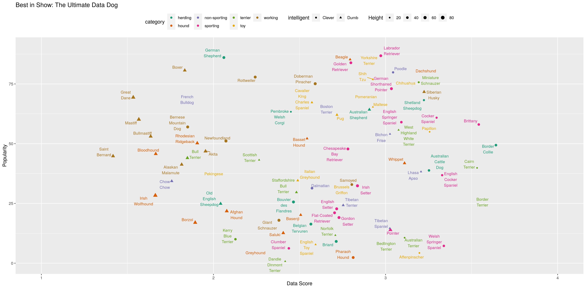

```{r setup, include=FALSE}
knitr::opts_chunk$set(echo = TRUE)
library('readxl')
library('ggplot2')
library('plotly')
library('tidyverse')
library('stringr')
library('ggrepel')
```

## Top dogs

In this homework, you will try to reproduce the fantastic infographic for [top dogs](https://informationisbeautiful.net/visualizations/best-in-show-whats-the-top-data-dog/), originally produced by David McCandless. The raw data can be found [here](https://docs.google.com/spreadsheets/d/1l_HfF5EaN-QgnLc2UYdCc7L2CVrk0p3VdGB1godOyhk/edit#gid=10). You can download this file by File -- Download As -- Microsoft Excel (.xlsx).

**Submission instructions**: Create a folder named `ds202_hw6`, and name the RMarkDown file including your solutions `hw6.Rmd` under this folder. For the submission, create a GitHub repository named `ds202_hw6` under your GitHub account, and push both `hw6.Rmd` and the knitted `hw6.html` before the deadline. I will assume you use the same GitHub username as for your HW5 submission. The latest version of your homework appearing on GitHub before the deadline is graded. *It is crucial to follow the exact folder structure and file names*, so that your homework can be reproduced and graded by an automated script. This homework is **due on April 22** before class.

1. Import the data and clean appropriately. To read in the data, you can use `readxl::read_xlsx('fileNameHere', sheet='sheetNameHere')`. Required data are in the sheets `Best in show` and `Best in show full sheet`. Take extra care on the column names and the first few rows of the data frame after read in.

```{r}
bis = readxl::read_xlsx('./best_in_show.xlsx', sheet='Best in show', range='A6:AW179') %>% select(-starts_with('...')) %>% filter(category != 'American Kennel Club group')

bis_full = readxl::read_xlsx('./best_in_show.xlsx', sheet='Best in show full sheet', range='A3:BS178') %>% select(-starts_with('...'))
colnames(bis_full) = colnames(bis_full) %>% 
	str_replace_all(' ', '.') %>% 
	str_replace_all('[\\-\\(\\)]', '') %>% 
	str_replace_all('^[1]', '.')
bis_full = bis_full %>% 
	filter(!is.na(POPULAR.RATING) & !is.na(ULTIMATE.TOP.DOG.MEGA.SCORE)) %>%
	rename(breed = Sources..see.bottom.right, 
		intelligence.ranking = ..INTELLIGENCE.TRAINABILITY.ranking, 
		popularity = POPULARITY.IN.US...7,
		overall_score = ULTIMATE.TOP.DOG.MEGA.SCORE) %>% 
	filter(breed != 'Dog breed') %>% 
	mutate(shoulder.height.cm = as.numeric(shoulder.height.cm), 
		popularity = 88 - as.numeric(popularity),
		overall_score = as.numeric(overall_score),
		breed = breed %>% str_replace_all(' ', '\n') %>% as.factor(),
		category = as.factor(category), 
		intelligence.category = as.factor(intelligence.category),
		size.category = as.factor(size.category),
		intelligence.ranking = as.numeric(intelligence.ranking)) %>%
	filter(!is.na(intelligence.ranking) & !is.na(popularity)) %>%
	mutate(intelligent = as.factor(ifelse(as.logical(intelligence.ranking <= 40)*1 == 1, "Clever", "Dumb")))

# str(bis)
str(bis_full)
```

2. Create a graphics similar to the  [top dogs](https://informationisbeautiful.net/visualizations/best-in-show-whats-the-top-data-dog/) figure. Your figure needs to display the following information with appropriate plotting elements:

- breed of dog
- type of dog (work, toy, etc.)
- size of dog
- data score 
- popularity
- intelligence of the dog
- appropriate legends & explanation

Hints and Notes:

- The breed of dog can be displayed without the silhouttes (text only is fine)
- Avoid (too much) overlaps!
- Choose a good color scheme.
- Your submission is supposed to be fully reproducible, i.e. the TA and I will 'knit' your submission in RStudio. 

```{r}
png("./rplot.png", width = 1920, height = 1080) # This is literally the only way...
pl = bis_full %>% ggplot(aes(y=popularity, x=overall_score, color=category, label=breed, size=shoulder.height.cm, shape=intelligent)) +
	geom_jitter() + scale_color_brewer(palette = "Dark2") + scale_size("Height", range=c(0.1, 3)) + 
	geom_text_repel(nudge_x=-0.01, direction='both', show.legend=FALSE, max.iter=10000) + 
	lims(y=c(0, 90), x=c(1, 4)) +
	labs(
		title="Best in Show: The Ultimate Data Dog", 
		x="Data Score", y="Popularity") +
	theme(legend.position = "top")
dev.off()
```

